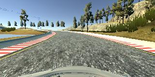
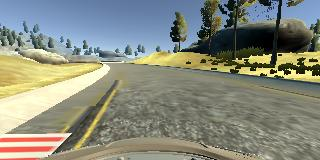
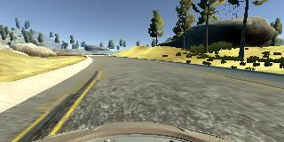
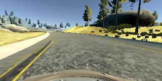
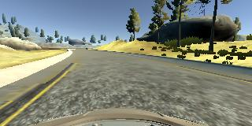
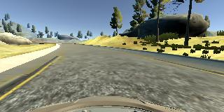
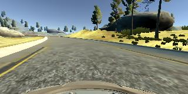
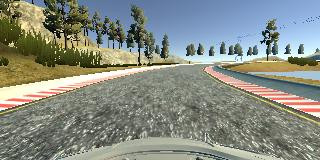
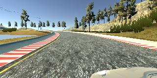
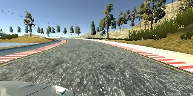

# **Behavioral Cloning** 


The goals / steps of this project are the following:

* Use the simulator to collect data of good driving behavior
* Build, a convolution neural network in Keras that predicts steering angles from images
* Train and validate the model with a training and validation set
* Test that the model successfully drives around track one without leaving the road
* Summarize the results with a written report


---
## Files Submitted & Code Quality

### 1. Submission includes all required files and can be used to run the simulator in autonomous mode

My project includes the following files:

* model.py containing the script to create and train the model
* drive2.py for driving the car in autonomous mode
* weights_model.h5 containing the weights of a trained convolution neural network 
* writeup_report.md summarizing the results

### 2. Submission includes functional code
Using the Udacity provided simulator and my `drive2.py` file, the car can be driven autonomously around the track by executing 
```sh
python drive2.py weights_model.h5
```

To use the weights is more stable when using different keras versions.
In my case I was not able to exchange a keras model within different keras versions.

### 3. Submission code is usable and readable

The `model.py` file contains describes a class for training and saving the convolution neural network. The file shows a pipeline I used for training and validating the model, and it contains comments to explain how the code works.
Moreover, the file `main.py` can be used to trigger training.

## Model Architecture and training data

### 1. An appropriate model architecture has been employed

My model consists of a convolution neural network with 7x7, 5x5, 3x3 and 2x2 filter sizes and depths between 32 and 265 (contructor of class `Model`)

The model includes RELU layers to introduce nonlinearity, and the data is normalized in the model using a Keras lambda layer. 

Moreover the model is cropped by using an Cropping2D layer.


### 2. Attempts to reduce overfitting in the model

The model contains dropout layers in order to reduce overfitting (see contructor of class `Model`). 

The model was trained and validated on different data sets to ensure that the model was not overfitting. To ensure this we used the method `train_test_split` from sklearn. The model was tested by running it through the simulator and ensuring that the vehicle could stay on the track.

### 3. Model parameter tuning

The model used an adam optimizer, and the learning rate was tuned manually to 0.0001, see `model.py`

### 4. Appropriate training data

Training data was chosen to keep the vehicle driving on the road. We recorded one lap with

* three times center lane driving in clockwise direction
* recovering from the left and right sides of the road 
* three times center lane driving in counterclockwise direction

For details about how I created the training data, see the next section. 

## Model Architecture and Training Strategy

### 1. Solution Design Approach

My first step was to use a convolution neural network model similar to the mentioned NVIDEA model. I thought this model might be appropriate because it is used in automotive.

In order to gauge how well the model was working, I split my image and steering angle data into a training and validation set. I found that my first model had a low mean squared error on the training set but a high mean squared error on the validation set. This implied that the model was overfitting. 

To combat the overfitting, I modified the model so that it was more general. Thus I added more layers especially dense layers.

Then I tested the model on a small training sets. There was still a lot overfitting. Thus I added some dropout layers. This helped a lot to get a stable model.

The final step was to run the simulator to see how well the car was driving around track. There was a single spots (last right curve) where the vehicle fell off the track. To improve the driving behavior in these cases, I found out that my training data was not very good in order to get safely through the curve. 
By analyzing the provided udacity data, I found out that the car was very stable within this last narrow right curve. Thus I decided to use my pretrained model (4 epochs) and use this model to do some kind of transfer learning (for 1 epoch) based on the provided udacity data. This worked out very well

At the end of the process, the vehicle is able to drive autonomously around the track without leaving the road.

### 2. Final Model Architecture

The final model architecture (see constructor of class `Model`) consisted of a convolution neural network with the following layers and layer sizes.

Here is a visualization of the architecture (note: visualizing the architecture is optional according to the project rubric)

| Layer        | Input Shape   | Output Shape  | Description              |
|--------------|---------------|---------------|--------------------------|
| Lambda       | (160, 320, 3) | (160, 320, 3) | Lambda f(x)=x/255 - 0.5  |
| Cropping2D   | (160, 320, 3) | (64, 320, 3)  | bottom=25, top=71        |
| Conv2D       | (64, 320, 3)  | (58, 314, 32) | 7x7 convolution          |
| Relu         |               |               | Relu activation function |
| MaxPooling2D | (58, 314, 32) | (29, 157, 32) | 2x2 pool size            |
| Relu         |               |               | Relu activation function |
| Conv2D       | (29, 157, 32) | (25, 153, 64) | 5x5 convolution          |
| Relu         |               |               | Relu activation function |
| MaxPooling2D | (25, 153, 64) | (12, 76, 64)  | 2x2 pool size            |
| Relu         |               |               | Relu activation function |
| Conv2D       | (12, 76, 64)  | (8, 72, 128)  | 5x5 convolution          |
| Relu         |               |               | Relu activation function |
| MaxPooling2D | (8, 72, 128)  | (4, 36, 128)  | 2x2 pool size            |
| Conv2D       | (4, 36, 128)  | (2, 34, 265)  | 3x3 convolution          |
| Relu         |               |               | Relu activation function |
| Dropout      |               |               | Dropout 0.2             |
| Conv2D       | (2, 34, 265)  | (1, 33, 265)  | 2x2 convolution          |
| Relu         |               |               | Relu activation function |
| Dropout      |               |               | Dropout 0.5             |
| Flatten      | (43, 158, 64) | 8745          | flattens the input       |
| Dropout      |               |               | Dropout 0.5              |
| Dense        | 8745          | 1024          | dense layser             |
| Relu         |               |               | Relu activation function |
| Dropout      |               |               | Dropout 0.5              |
| Dense        | 1024          | 128          | dense layser             |
| Relu         |               |               | Relu activation function |
| Dropout      |               |               | Dropout 0.2              |
| Dense        | 128          | 10          | dense layser             |
| Relu         |               |               | Relu activation function |
| Dense        | 10          | 1          | dense layser             |
| Relu         |               |               | Relu activation function |

### 3. Creation of the Training Set & Training Process

To capture good driving behavior, I first recorded two laps on track one using center lane driving om counterclockwise (=initial) direction. Here is an example image of center lane driving:



I then recorded the vehicle recovering from the left side and right sides of the road back to center so that the vehicle would learn to react in bad situations. These images show what a recovery looks like








I also was going one round in clockwise direction

To augment the data sat, I also flipped images and angles thinking that this would increase diversity. For example, here is an image that has then been flipped:




Also we used different camera positions:





In order to treat these positions differently, we added 0.2 to the steering angle of the left one and -0.2 to the steering angle of the right one


After the collection process, I had around 16000 number of data points. Since cropping of the images in done in the keras model, I added no additional preprocessing.


I finally randomly shuffled the data set and put 20% of the data into a validation set. 

I used this training data for training the model. The validation set helped determine if the model was over or under fitting. The ideal number of epochs was 4 as evidenced by an increasing validation error. 
