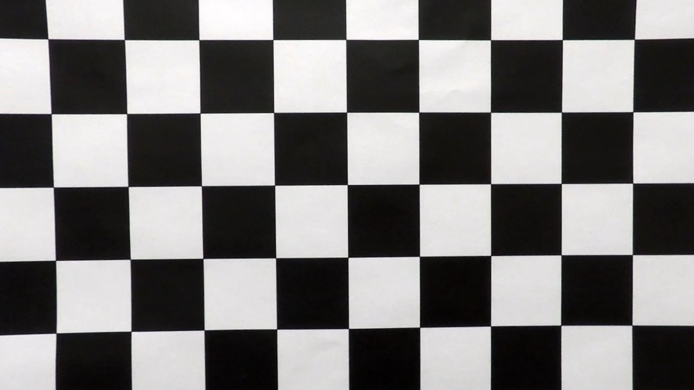

LL# **Advanced Lane Finding Project**

The goals / steps of this project are the following:

* Compute the camera calibration matrix and distortion coefficients given a set of chessboard images.
* Apply a distortion correction to raw images.
* Use color transforms, gradients, etc., to create a thresholded binary image.
* Apply a perspective transform to rectify binary image ("birds-eye view").
* Detect lane pixels and fit to find the lane boundary.
* Determine the curvature of the lane and vehicle position with respect to center.
* Warp the detected lane boundaries back onto the original image.
* Output visual display of the lane boundaries and numerical estimation of lane curvature and vehicle position.


### Camera Calibration

#### 1. Briefly state how you computed the camera matrix and distortion coefficients. Provide an example of a distortion corrected calibration image.

Camera calibration is implemented in the class `Calibrate`
An instance of this class needs the following parameters: 

* `nx`: the number of inside corners in x 
* `ny`: the number of inside corners in y
* `input_folder`: A Folder with some chessboard pictures

I start by preparing "object points", which will be the (x, y, z) coordinates of the chessboard corners in the world. Here I am assuming the chessboard is fixed on the (x, y) plane at z=0, such that the object points are the same for each calibration image.  Thus, `objp` is just a replicated array of coordinates, and `objpoints` will be appended with a copy of it every time I successfully detect all chessboard corners in a test image.  `imgpoints` will be appended with the (x, y) pixel position of each of the corners in the image plane with each successful chessboard detection.  

I then used the output `objpoints` and `imgpoints` to compute the camera calibration and distortion coefficients using the `cv2.calibrateCamera()` function.  I applied this distortion correction to the test image using the `cv2.undistort()` function and obtained this result: 

 

The left side represents the distorted image, while on the right side we can see the undistorted image.

### Pipeline (single images)

All hyperparameter we discuss in this section are summarized in the class `Params`. You can instantiate another object of this class in order to play around with these parameter.

#### 1. Calibration

To demonstrate the pipeline, I will first describe how I apply the distortion correction to one of the test images like this one:


In order to undistort this image we apply the following method

```python
undist = cal.undistort(img)
```
Hereby, `cal` represents an instance of the calibration class.


#### 2. Describe how (and identify where in your code) you used color transforms, gradients or other methods to create a thresholded binary image.  Provide an example of a binary image result.

I used a combination of color and gradient thresholds to generate a binary image. This is done by the method `gradientAndColorChannelTransform` within `pipeline.py`:

This method has the following steps:

* convert image to HLS space
* calculate a yellow and white binary 
    *   yellow: hls in [20, 100, 100] to [140, 255, 255]
    *   white: hls in [0, 150 ,0] to [255, 255, 255]
* calculate sobel derivatives of l and s channel with directions:
    * magnitude: (100, 255)
    * directions: (0.7, 1.3)

Finally we combined all in once:
$$ (s_{\text{sobel}} \lor l_{\text{sobel}}) \land (thres_{\text{yellow}} \lor thres_{\text{white}}) $$

 

#### 3. perspective transform and an example of a transformed image.

The code for my perspective transform is wrapped in a class `Perspective`.
To instantiate this class we need set the following  parameter:

* `src`: source points
* `dst`: destination points
* `image_path`: path to an example image. (most relevant information here is the size)

The tranformation matrix and its inverse are computed when the class gets instantiated with an object `per`.
We can access them via `per.M` and `per.Minv`. To apply this perspective transform to an image, we can use the following:
```python
binary_warped = per.apply(binary)
```

I chose the hardcode the source and destination points in the following manner:

```python
src = np.float32([[204, 720], [595, 450], [684, 450], [1104, 720]])
dst = np.float32([[center - offset, im_shape[0]], [center - offset, 0], 
                  [center + offset, 0], [center + offset, im_shape[0]]])
```
while `center = int(im_shape[1] / 2)`.

I verified that my perspective transform was working as expected by doing an perspective transform in the same way within the calibration class.

 

Moreover, I checked that the lanes in the warped image are almost parallel:

 
 

#### 4. lane-line pixels and fitting with a polynomial

Input for this step is a binary warped image.
In order to find all relevant pixels to fit a line we use the following methods:

* sliding window approach: Hereby we start at the bottom where most pixels are above. Then we iterate upwards.
* here we used our fitted curve from the last frame. To be more precise, we search in an \( \epsilon \) hose around the last found curve. Hereby we used \(\epsilon=100\) (pixel)

Obviously, the first method can be used with no a prior knowledge. But as soon we have this knowledge we can use the other one.

Finally we fitted the lane with a 2nd order polynomial kinda like this:
```python
self.left.current_fit = np.polyfit(lefty, leftx, 2)
self.right.current_fit = np.polyfit(righty, rightx, 2)
```
This is part of the method `findLanes` which belongs to the class `Lanes`. The `Lanes` class describes the left an right lane while each lane itself is an instance of the class `Lane`.

A fitted left an right lane might look like this

 


#### 5. radius of curvature of the lane and the position of the vehicle with respect to center.

First of all we set the following parameters to transfer from pixel to meters:

* \(ym_{pp} = \frac{40}{720}\)  # meters per pixel in y dimension
* \(xm_{pp} = \frac{3.7}{600}\)  # meters per pixel in x dimension

The curvature is 
$$\frac{{\sqrt{1 + (2 A_{new} y_{new} + B_{new})^2 }}^3}{|2 A_{new}|}$$
Hereby,

* \(A_{new} = A \cdot \frac{ym_{pp}}{xm_{pp}^2}\), with the fitted quadratic parameter \(A\)
* \(B_{new} = B \cdot \frac{ym_{pp}}{xm_{pp}}\), with the fitted linear parameter \(B\)
* \(y_{new} = y \cdot ym_{pp}\), with \(y\) as the image height

The distance from the center is computed as follows:
$$ dist = \Big|\frac{3.7}{2} - xm_{pp}(center - pos_{\text{leftLine}})\Big| $$
center is the center of the image, where the camera is located.

Both values are computed by methods within the class `Lane`

#### 6. Example image of result plotted back down onto the road.

The final plotting is done with the method `plotLanesToUndistoredImage` in the class `Lanes`. 
Here is an example of my result on a test image:

 

---

### Pipeline (video)

#### 1. Link to final video output.

Here's a [link to my video result](./output_test_videos/project_video.mp4)

---

### Discussion

My approach combined a color threshold in hls space with some gradients to find a crucial binary. To find a good binary is very import, since all the following lane findings relies on this.   
I think my approach produces very unstable binaries, so it fails already in the challenge video. Maybe the restriction to white and yellow color is to rigorous. 
Nevertheless, it worked for the project video.
In order to improve my approach there can still be done some parameter tuning to get better results. In order to produce a stable binary, I think one should combine my simple threshold search (for generating the binary) with a hough transform.
