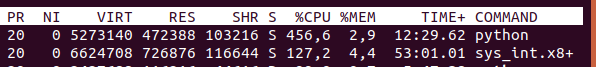
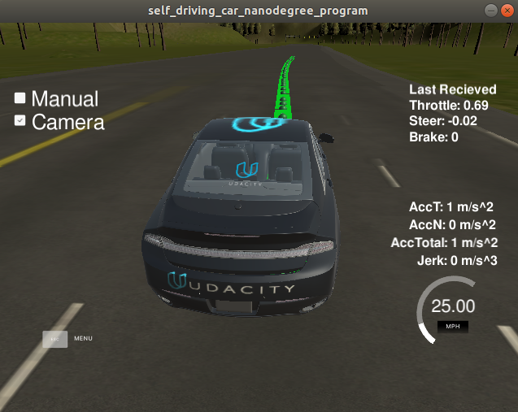
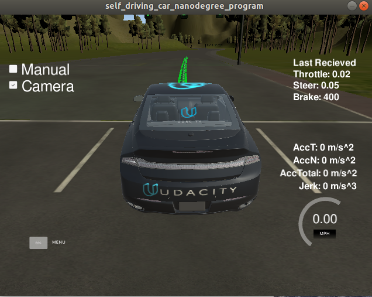
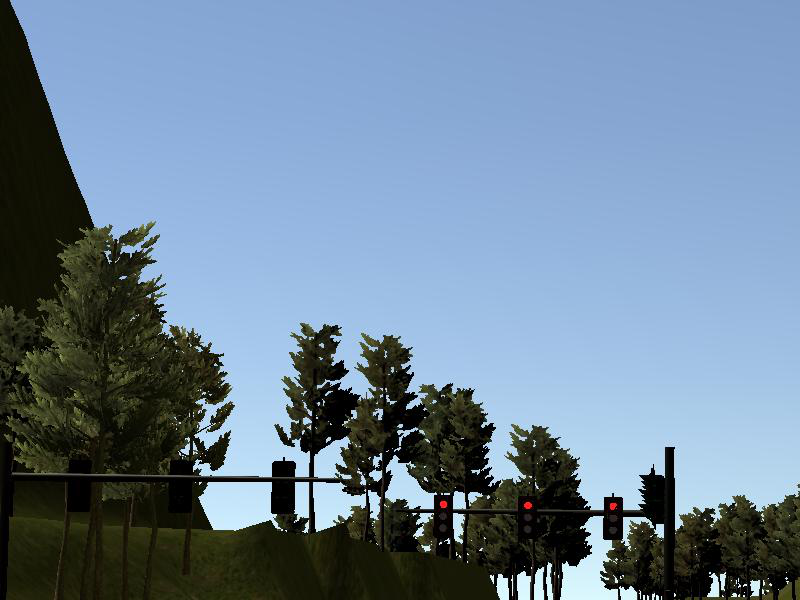

# Udacity Self-Driving Car Nanodegree: Capstone Project

This is the project repo represents a solution to the final project of the Udacity Self-Driving Car Nanodegree: Programming a Real Self-Driving Car. For more information about the base project, see the project https://github.com/udacity/CarND-Capstone


## Getting started

Please use **one** of the two installation options, either native **or** docker installation.

### Native Installation

* Be sure that your workstation is running Ubuntu 16.04 Xenial Xerus or Ubuntu 14.04 Trusty Tahir. [Ubuntu downloads can be found here](https://www.ubuntu.com/download/desktop).
* If using a Virtual Machine to install Ubuntu, use the following configuration as minimum:
  * 2 CPU
  * 2 GB system memory
  * 25 GB of free hard drive space

  The Udacity provided virtual machine has ROS and Dataspeed DBW already installed, so you can skip the next two steps if you are using this.

* Follow these instructions to install ROS
  * [ROS Kinetic](http://wiki.ros.org/kinetic/Installation/Ubuntu) if you have Ubuntu 16.04.
  * [ROS Indigo](http://wiki.ros.org/indigo/Installation/Ubuntu) if you have Ubuntu 14.04.
* [Dataspeed DBW](https://bitbucket.org/DataspeedInc/dbw_mkz_ros)
  * Use this option to install the SDK on a workstation that already has ROS installed: [One Line SDK Install (binary)](https://bitbucket.org/DataspeedInc/dbw_mkz_ros/src/81e63fcc335d7b64139d7482017d6a97b405e250/ROS_SETUP.md?fileviewer=file-view-default)
* Download the [Udacity Simulator](https://github.com/udacity/CarND-Capstone/releases).

For performance reasons it is best to run the simulator on the host, while ros in a virtual machine. In order to do port forwarding (port 4567) you can use the following guideline
https://www.howtogeek.com/122641/how-to-forward-ports-to-a-virtual-machine-and-use-it-as-a-server/


### Docker Installation
[Install Docker](https://docs.docker.com/engine/installation/)

Build the docker container
```bash
docker build . -t capstone
```

Run the docker file
```bash
docker run -p 4567:4567 -v $PWD:/capstone -v /tmp/log:/root/.ros/ --rm -it capstone
```

Finally, when the docker container is up and running execute the following two lines inside the container:
```bash
pip install pandas sklearn
pip install pillow --upgrade
```

In order to start the application follow:
```bash
cd ros
catkin_make
source devel/setup.sh
roslaunch launch/styx.launch

```
and run the simulator on the host

### Problems:
During my implementation I faced several problems:


#### Capstone Simulator Latency:
    Basically, it was not possible to keep the car in lane. 
    It helped me a lot to decrease the lookahead waypoints, i.e `LOOKAHEAD_WPS = 50`  <br>
    Moreover, it was very helpful to use containerization (docker) instead of virtualization (virtual machine).
    The reason for the that a python process gets way to heavy:
    
    

    OS: Ubuntu 18.04 LTS, hardware: AMD® Ryzen 5 1600 six-core processor × 12 , GeForce GTX 1050 Ti/PCIe/SSE2, memory 15,7 GiB

    See discussion in see https://github.com/udacity/CarND-Capstone/issues/210

#### tensorflow graph with ros:
I faced the problem (see below) by loading pretrained keras model weights. In order to solve this problem it was important to set

```bash
self.graph = tf.get_default_graph()
```

after loading the weights and use 

```bash
with self.graph.as_default():
  prob = self.model.predict(image)
```
when predicting.

```pyhton
[ERROR] [1548096169.805629]: bad callback: <bound method TLDetector.image_cb of <__main__.TLDetector object at 0x7ff44f7d1790>>
Traceback (most recent call last):
  File "/opt/ros/kinetic/lib/python2.7/dist-packages/rospy/topics.py", line 750, in _invoke_callback
    cb(msg)
  File "/capstone/ros/src/tl_detector/tl_detector.py", line 94, in image_cb
    light_wp, state = self.process_traffic_lights()
  File "/capstone/ros/src/tl_detector/tl_detector.py", line 191, in process_traffic_lights
    state = self.get_light_state()
  File "/capstone/ros/src/tl_detector/tl_detector.py", line 152, in get_light_state
    return self.light_classifier.get_classification(cv_image)
  File "/capstone/ros/src/tl_detector/light_classification/tl_classifier.py", line 32, in get_classification
    return self.model.predict(image)
  File "/capstone/ros/src/tl_detector/light_classification/model.py", line 139, in predict
    prob = self.model.predict(image)
  File "/usr/local/lib/python2.7/dist-packages/keras/models.py", line 913, in predict
    return self.model.predict(x, batch_size=batch_size, verbose=verbose)
  File "/usr/local/lib/python2.7/dist-packages/keras/engine/training.py", line 1710, in predict
    self._make_predict_function()
  File "/usr/local/lib/python2.7/dist-packages/keras/engine/training.py", line 999, in _make_predict_function
    **kwargs)
  File "/usr/local/lib/python2.7/dist-packages/keras/backend/tensorflow_backend.py", line 2297, in function
    return Function(inputs, outputs, updates=updates, **kwargs)
  File "/usr/local/lib/python2.7/dist-packages/keras/backend/tensorflow_backend.py", line 2246, in __init__
    with tf.control_dependencies(self.outputs):
  File "/usr/local/lib/python2.7/dist-packages/tensorflow/python/framework/ops.py", line 3936, in control_dependencies
    return get_default_graph().control_dependencies(control_inputs)
  File "/usr/local/lib/python2.7/dist-packages/tensorflow/python/framework/ops.py", line 3665, in control_dependencies
    c = self.as_graph_element(c)
  File "/usr/local/lib/python2.7/dist-packages/tensorflow/python/framework/ops.py", line 2708, in as_graph_element
    return self._as_graph_element_locked(obj, allow_tensor, allow_operation)
  File "/usr/local/lib/python2.7/dist-packages/tensorflow/python/framework/ops.py", line 2787, in _as_graph_element_locked
    raise ValueError("Tensor %s is not an element of this graph." % obj)
ValueError: Tensor Tensor("dense_4/Softmax:0", shape=(?, 3), dtype=float32) is not an element of this graph.
```


## Functionality

The ros system gives steering, brake and throttle to a car (simulator) such that it follows a lane with almost constant speed and stops on red lights.




## Model
The following picture gives a good overview about this project:


* **obstacle detection**: ros node to detect obstacles
* **traffic light detection**: ros node to do traffic light detection
    This is basically done by using a previously trained CNN. The trained weights are stored within
    ```bash
    src/tl_detector/light_classification/model_weights.h5
    ```
    To train the model use the python script `train.py` in the same folder.
    In order to generate training data used by `train.py` set 
    ```python
    self.generate_training_date = True
    ```
    within `tl_detector.py`.
    This will generate labeled training data like this:
    
    

    and a file `labels.txt` that maps each image to a label.

* **waypoint loader**: ros node to load global waypoints
* **waypoint follower**: ros node to translate the waypoints into twist commands
* **waypoint updater**: ros node to update the waypoints based on red light. 
* **dbw**: ros node to translate twist commands into steering, brake and throttle. Basically this is done by using PID controllers

## Discussion
For training the CNN we used only around 1500 images, thus it is very likely that the model generalizes not to good.


