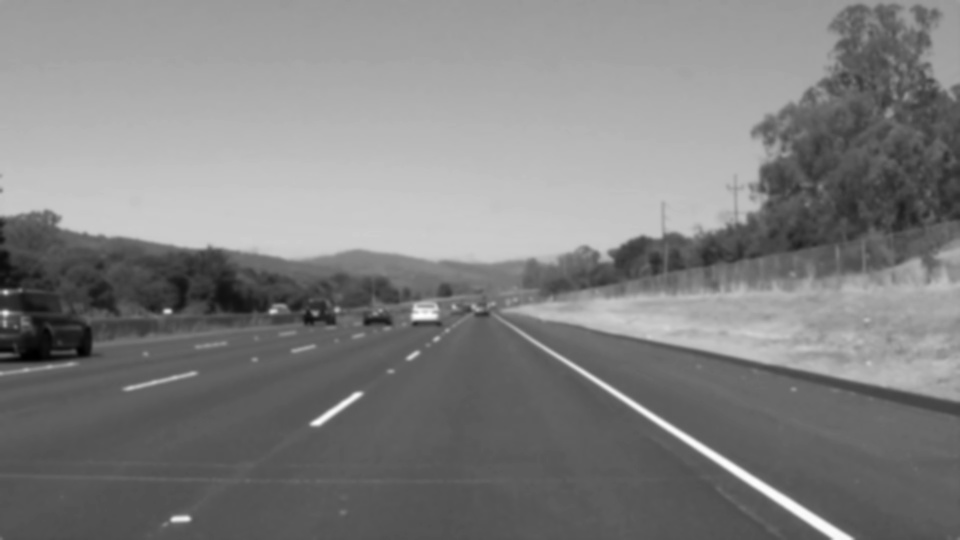
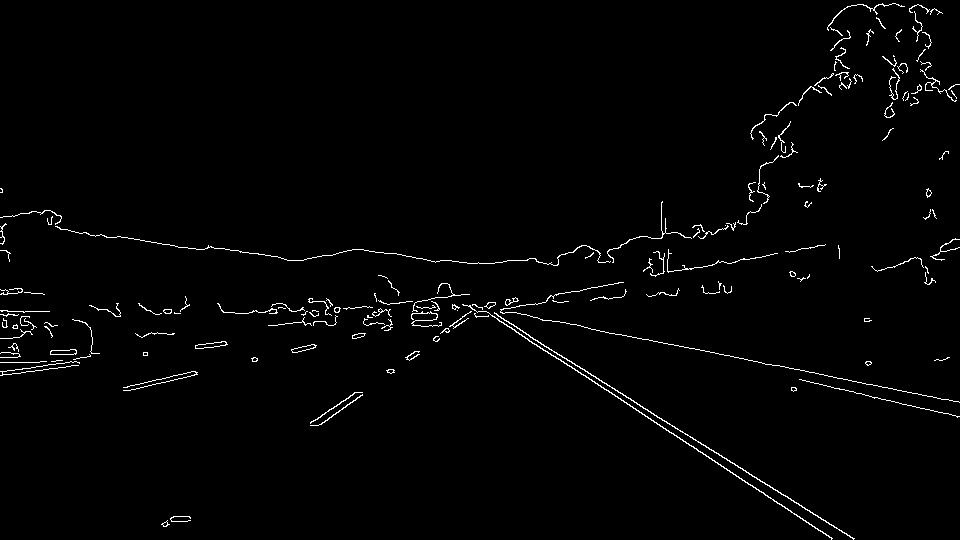
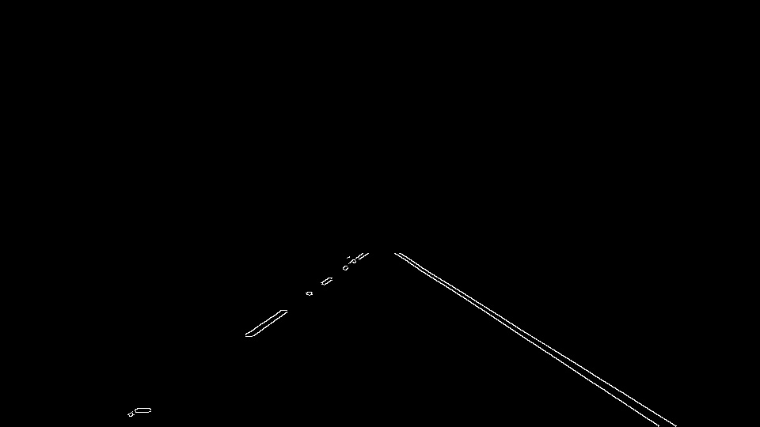
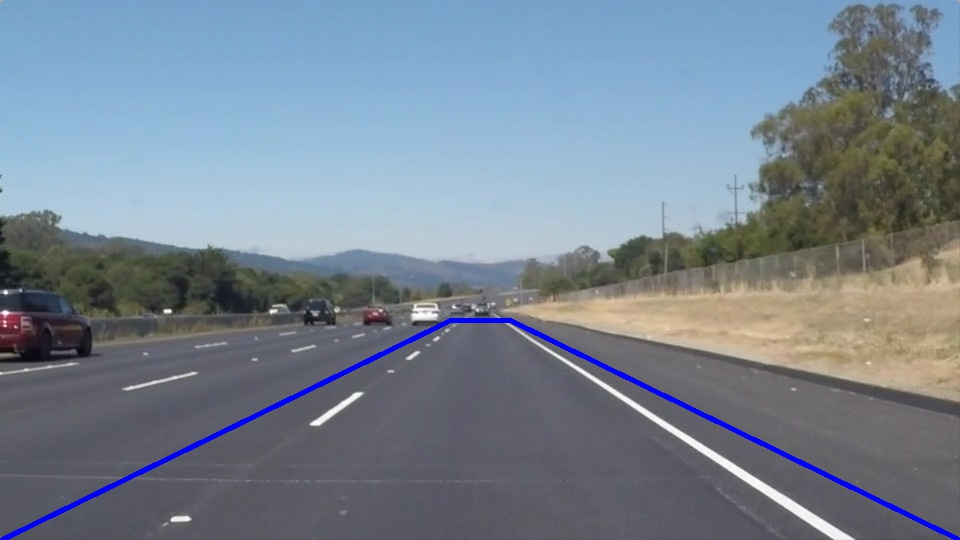
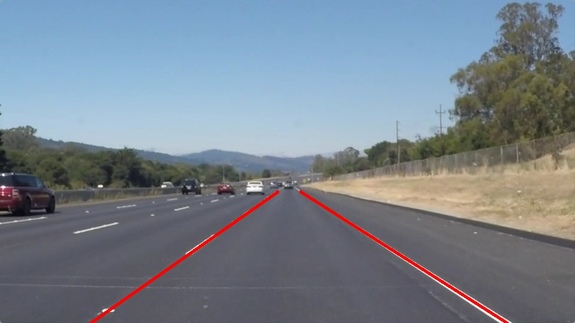

# **Finding Lane Lines on the Road** 

---

### Description
This project shows how to find Lane Lines on roads based on front camera images.

### A.) How it works
We will demonstrate this by using the following image: 

My pipeline consisted of 5 steps:

1. convert to grayscale  

2. blur by using gaussian filter (with size 5)  

3. do Canny transformation with an lower threshold of 50 and an upper threshold of 100 

4. mask the image to a symmetric polygonal region 
   
The polygon region is shown in the second image
5. do a Hough transformation with the following parameters
    1. distance resolution in pixels of 2
    2. angular resolution in radians  \(\pi/180\)
    3. minimum number of votes of 15
    4. minimum number of pixels making up a line of 40
    5. maximum gap in pixels between connectable line segments of 15
    
    

6. do a cluster analysis (K-Means) with two clusters based on the parameters of each line found by the hough transformation. 

### B.) Potential shortcomings with your current pipeline
The current solution works fine only for straight lanes. In case of narrow curves there will be a problem.
Another problem could be cars that cross the lines in a short distance in front of the car.
Moreover, as we have seen already in the challenge, shadows lead to problems as well.

### C.) Suggest possible improvements to your pipeline

A possible improvement would be to do use to calculate the lines for the current images based on the previous calculated lines. This is based on the fact, that the lines will change in a continuous way.

Another potential improvement could be the following: In the current implementation we use K-Means on the parameters of the lines (derivative an y axis section). Thus we somehow take the mean of the parameters. I think it would be better to compute the mean on parametrizations of the lines. By doing so one could give long lines a more heavy weight.
