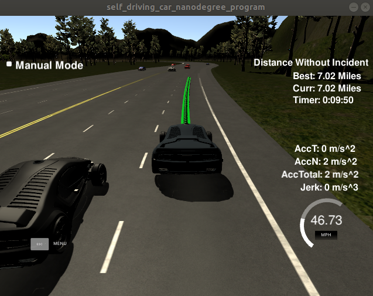

# CarND-Path-Planning-Project
Self-Driving Car Engineer Nanodegree Program

## getting started
### how to build

1. Clone this repo.
2. Make a build directory: `mkdir build && cd build`
3. Compile: `cmake ../src && make`
4. Run it: `./path_planning`.

### run the simulator
You can download the Term3 Simulator which contains the Path Planning Project from the [releases tab (https://github.com/udacity/self-driving-car-sim/releases/tag/T3_v1.2).

#### The map of the highway is in data/highway_map.txt
Each waypoint in the list contains  [x,y,s,dx,dy] values. x and y are the waypoint's map coordinate position, the s value is the distance along the road to get to that waypoint in meters, the dx and dy values define the unit normal vector pointing outward of the highway loop.

The highway's waypoints loop around so the frenet s value, distance along the road, goes from 0 to 6945.554.

## Model
For trajectory planning we use a combination of JMP and spline interpolations. To be more precise we use an overall spline interpolation (based on may waypoints) for driving in an lane. The lane changes are done by using jerk minimizing polynomials.

Bahaviour planning is based on two cost functions:

* inefficiency cost: this makes slow trajectories more expensive
* safety cost: this mainly makes lane changes more expensive than keep the lane

The next behaviour is thus planned based on the next (safe reachable) state with lowest cost.

## Implementation

the main method is `start_piloted_driving` in `Vehicle` class.
This method calls two important methods in `Vehicle` class:

* `follow`: implemention to keep the current lane
* `change_lane`: implemention to change lanes

trajectory planning:

* `follow()`: compute trajectory to follow the current lane
* `change_lane(string next_state)`: compute trajectory to change lane
* `drive2(vector<double> speed, vector<double> d)`: generate trajectory based on speed and d
* `compute_paramteters_JMP(start, end, T)`: compute parameters for jerk minimizing polynomial
* `double eval_JMP( x, params)`: evaluate jerk minimizing polynomial

behaviour planning:

* `get_successor_states()`: get all (safe) reachable next states
* `set_target_state(next states)`: set target state based on total cost
* `inefficiency_cost()`: cost function inefficiency
* `safety_cost()`: cost function safety

## Discussion

We used a approach to keep all as long a possible in frenet coordinates. 

The nice thing here is to have a spline interpolation only once in initialization, see constructor of class `road`, i.e. the frenet coordinate `s` can be seen as the global time and we use therefore arclength parametrization.
Therefore if we have a lot of waypoints the (cost expensive) computation (O(N)) of the spline is done only once. The lookup is of logarithmic complexity O(log(N)), see https://kluge.in-chemnitz.de/opensource/spline/ for more details.

The problem here is, that it is very hard to control the speed. Therefore our car is limited to 47.
If I increase this value, there might be a little peak where the speed is greater 50. 

A idea to solve this problem is to calculate the curvature and take this into account. This is done in the method `curvature` in class `Vehicle`. In order to get a better speed approximation (even in curves with high curvature) this could be used as a balancing factor.

---

## Dependencies

* cmake >= 3.5
  * All OSes: [click here for installation instructions](https://cmake.org/install/)
* make >= 4.1
  

