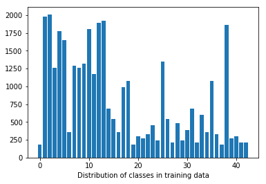
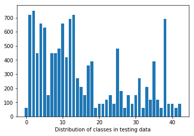
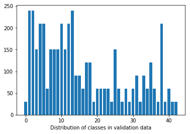
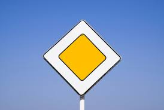
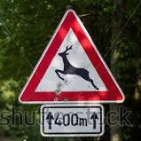
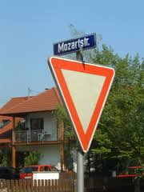
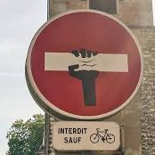
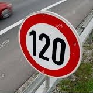
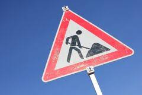
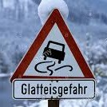

# **Traffic Sign Recognition** 

**Build a Traffic Sign Recognition Project**

The goals / steps of this project are the following:

* Load the data set (see below for links to the project data set)
* Explore, summarize and visualize the data set
* Design, train and test a model architecture
* Use the model to make predictions on new images
* Analyze the softmax probabilities of the new images
* Summarize the results with a written report

### Data Set Summary & Exploration

#### 1. basic summary of the data set

I used the pandas library to calculate summary statistics of the traffic
signs data set:

* The size of training set is 34799
* The size of the validation set is 4410
* The size of test set is 12630
* The shape of a traffic sign image is (32, 32, 3)
* The number of unique classes/labels in the data set is 43

#### 2. exploratory visualization of the dataset.

Here is an exploratory visualization of the data set. It is a bar chart showing how the 43 different classes are distributed within the training, validation and test set

  

### Design and Test a Model Architecture

#### 1. preprocessing

We decided to do little preprocessing. Therefore we scaled the images to a range from 0 to 1. We did this by dividing all images with 255.

#### 2. model architecture

My final model consisted of the following layers:

| Layer         	|	Input       | Output       |     Description	        			                | 
|:-----------------:|:-------------:|:------------:|:------------------------------------------------------:| 
| Conv1             | (32x32x3)     | (32x32x6)    | 1x1 convolution with stride 1x1, padding "VALID"   	| 
| Relu              | (32x32x6)     | (32x32x6)    | relu transformation	                                | 
| Conv2             | (32x32x6)     | (14x14x18)   | 5x5 convolution with stride 2x2, padding "VALID   	    | 
| Relu              | (14x14x18)    | (14x14x18)   | relu transformation  			            	        | 
| Conv3             | (14x14x18)    | (5x5x54)     | 5x5 convolution with stride 2x2, padding "VALID   	    | 
| Relu              | (5x5x54)      | (5x5x54)     | relu transformation  			            	        | 
| Flatten           | (5x5x54)      | (54*5*5)     | flatten                                                |
| Dense1            | (1350)        | (1000)       | Dense layer   	                                        | 
| Dropout1          | (1000)        | (1000)       | Dropout with probability keep_prob   	                | 
| Relu              | (1000)        | (1000)       | relu transformation                 	                | 
| Dense2            | (1000)        | (500)        | Dense layer   	                                        | 
| Dropout2          | (500)         | (500)        | Dropout with probability keep_prob   	                | 
| Relu              | (500)         | (500)        | relu transformation       	                            | 
| Dense3            | (500)         | (250)        | Dense layer   	                                        | 
| Dropout3          | (250)         | (250)        | Dropout with probability keep_prob   	                | 
| Relu              | (250)         | (250)        | relu transformation                 	                | 
| Dense4            | (250)         | (100)        | Dense layer   	                                        | 
| Dropout4          | (100)         | (100)        | Dropout with probability keep_prob   	                | 
| Relu              | (100)         | (100)        | relu transformation                	                | 
| Dense5            | (100)         | (43)         | Dense layer   	                                        | 
| Softmax           | | | |
 

#### 3. training the model.

To train the model, I used an AdamOptimizer. Moreover we used the following hyperparams:

* BATCH_SIZE = 128
* EPOCHS = 60
* learning_rate = 0.001

#### 4. finding a solution and getting the validation set accuracy to be at least 0.93.

My final model results were:

* training set accuracy of 95%
* validation set accuracy of 94%
* test set accuracy of 100%

The first architecture that I tried was LeNet5. 
We found out that this was not generalizing good enough, so we enlarged the net to total three conv layers and 5 dense layers. By training we get a test accuracy of 100%, so maybe the trained model is still not generalizing to good. Nevertheless, the training was good enough to get a testing accuracy of 94%.
Since our model is quite large and we use dropout, we found out that more epochs are a good chance to build a more stable classifier. This is the reason we enlarged the number of epochs to 60.
The reason we added a third conv layer was to find even more complicated structures within the traffic signs. The additional dense layers are a good chance to explain a great variance between the images.

 

### Test a Model on New Images

#### 1. five German traffic signs found on the web and provide them in the report. For each image, discuss what quality or qualities might be difficult to classify.

Here are seven German traffic signs that I found on the web:

The last image might be difficult to classify because there is an additional sign overlapping with the primary sign.

#### 2. model's predictions on these new traffic signs 

Here are the results of the prediction:

| Image			        |     Prediction	        					| 
|:---------------------:|:---------------------------------------------:| 
| Priority road     	| Priority road  								| 
| Wild animals crossing | Right-of-way at the next intersection 		|
| Yield					| Yield											|
| No passing	      	| No passing					 				|
| Speed limit (120km/h)	| Speed limit (120km/h)      	       			|
| Road work	            | Speed limit (70km/h)     	               		|
| Slippery road     	| Right-of-way at the next intersection      	|

The model was able to correctly guess 5 of the 7 traffic signs, which gives an accuracy of 71%. This no perfectly compares favorably to the accuracy on the test set but we think the chosen web pictures were a little bit harder.

#### 3. Describe how certain the model is when predicting on each of the five new images by looking at the softmax probabilities for each prediction. Provide the top 5 softmax probabilities for each image along with the sign type of each probability. 

The code for making predictions on my final model is located in the 11th cell of the Ipython notebook. By "==>" we mark the correct sign.

* For the first image, the model is relatively sure that this is a Priority road (probability of 1.0), and the image does contain a stop sign. The top five soft max probabilities were

    

        ==>Priority road : 1.0
        Speed limit (20km/h) : 0.0
        Speed limit (30km/h) : 0.0
        Speed limit (50km/h) : 0.0
        Speed limit (60km/h) : 0.0
        Speed limit (70km/h) : 0.0
        Speed limit (80km/h) : 0.0
        End of speed limit (80km/h) : 0.0
        Speed limit (100km/h) : 0.0
        Speed limit (120km/h) : 0.0

* For the second image, the model gives a quite close (right) answer (wild animal crossing). Prob: 0.31

    

        ==>Wild animals crossing : 0.3189881
        Dangerous curve to the left : 0.1668453
        Bicycles crossing : 0.1595066
        Speed limit (80km/h) : 0.10766848
        Dangerous curve to the right : 0.038294982
        Road work : 0.033820353
        Double curve : 0.03368756
        Speed limit (120km/h) : 0.023980232
        Speed limit (100km/h) : 0.021168485
        Road narrows on the right : 0.02099079

* For the third image, the model is quite sure to see a yield sign (prob 0.98)

    
        
        ==>Yield : 0.9830073
        No entry : 0.0077782157
        No passing for vehicles over 3.5 metric tons : 0.0044792583
        Road work : 0.0029814017
        No passing : 0.0013500318
        Speed limit (60km/h) : 0.0003408259
        Dangerous curve to the right : 2.5123582e-05
        Stop : 2.107852e-05
        Priority road : 6.520524e-06
        No vehicles : 4.0629543e-06

* For the fourth image, the model is very sure (0.97) to face a stop sign. This is wrong, but the correct sign (no entry) is on the second place

    

        Stop : 0.96896166
        ==>No passing : 0.017404199
        No entry : 0.0055506495
        No passing for vehicles over 3.5 metric tons : 0.0045940443
        Road work : 0.00088982185
        Speed limit (80km/h) : 0.00073545723
        Speed limit (60km/h) : 0.00060853595
        Yield : 0.000214718
        Priority road : 0.0001475482
        Dangerous curve to the right : 0.000133897

* For the fifth image, the decision is very close (0.54 vs. 0.43) but the decision "120km/h" is correct
 
    

        ==>Speed limit (120km/h) : 0.5616659
        Speed limit (70km/h) : 0.43820578
        Speed limit (50km/h) : 0.00010849006
        Speed limit (30km/h) : 1.3081639e-05
        Speed limit (20km/h) : 5.2333016e-06
        No vehicles : 9.542956e-07
        Speed limit (100km/h) : 5.314728e-07
        Traffic signals : 1.4761992e-10
        General caution : 1.209402e-10
        Speed limit (80km/h) : 9.4391e-11

* For the sixth image, the model is relatively sure to face "road work" (0.89). This is correct

    

        ==>Road work : 0.88932645
        General caution : 0.10233635
        Bumpy road : 0.0031136111
        Wild animals crossing : 0.0026977516
        Dangerous curve to the right : 0.0006473789
        Go straight or left : 0.0003214599
        Traffic signals : 0.0002851158
        No entry : 0.00026328018
        Beware of ice/snow : 0.00025095764
        Bicycles crossing : 0.00019811965

* For the seventh image, the first three in ranking are super close together (0.30, 0.29, 0.22). The decision (Double road) is false, but the correct label "Slippery road" is on the second place.

    

        Double curve : 0.29747835
        ==>Slippery road : 0.29009384
        Right-of-way at the next intersection : 0.22806896
        Beware of ice/snow : 0.094566844
        Pedestrians : 0.040958878
        Dangerous curve to the left : 0.022957562
        Speed limit (100km/h) : 0.007821736
        Wild animals crossing : 0.0059385933
        Road work : 0.0019118341

